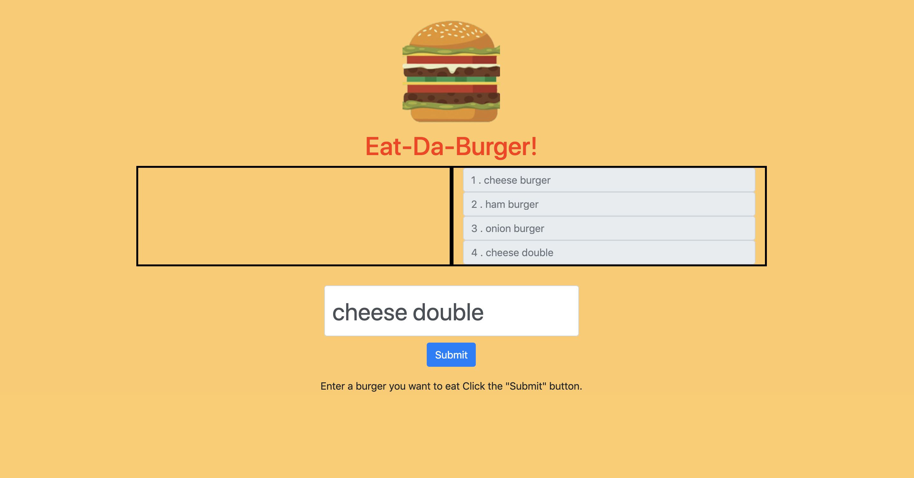

# Eat-Da-Burger

### Overview

This app is a burger logger with MySQL, Node, Express and Sequelize, and follows the MVC design pattern.

* Eat-Da-Burger! is a restaurant app that lets users input the names of burgers they'd like to eat.

* Whenever a user submits a burger's name, the app will display the burger on the left side of the page -- waiting to be devoured.

* Each burger in the waiting area also has a `Devour it!` button. When the user clicks it, the burger will move to the right side of the page.

* The app will store every burger in a database, whether devoured or not.

* Deployed link to Heroku: 




#### Directory structure

All the recommended files and directories should look like the following structure:

```
.
├── config
│   └── config.json
│ 
├── controllers
│   └── burgersController.js
│
├── models
│   ├── index.js
│   └── burger.js
│ 
├── node_modules
│ 
├── package.json
│
├── public
│   ├── assets
│   │   ├── css
│   │   │   └── burger_style.css
│   │   ├── img
│   │   │   └── ...
│   │   └── js
│   │       └── burgers.js
│   └── index.html
│
├── schema.sql
│
├── server.js

```

